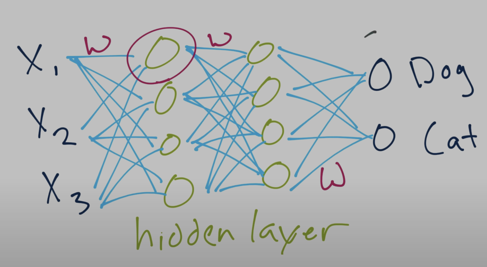

### Learning the framework of a neural network 

- A neural network is something which connects explanatory variables to the final outcome (here, we have dogs and cats).  
- The NN is defined when the explanatory variables are connected to a 'hidden layer' of neurons, which is then connected to the outcomes  
- A Deep Neural Network is defined when there are multiple hidden layers  

Essentially, a neural network will identify the image and come up with a maximum likelihood for the image being a cat or dog, by summing up all the probabilities from each neuron and placing it on a sigmoid distribution.  
It will then produce a probability for finding whether the image is a cat or dog, giving a probability for each.  
For example, if the output gives that the image is 75% dog and 25% cat, we take the arg(ument) max and essentially idenify the image to be a dog.

### Tensorflow terminology 
- The flatten layer reshapes multidimensional tensors into a single 1D vector, hence the name 'flattening'. 
- The dense layer is a fully connected layer that learns complex patterns from the input.  
- *Flatten* is typicaly used before *Dense* layers in CNNs to prepare data 

*relu* stands for rectified linear unit - it outputs the input directly if its positive, and zero if otherwise. This will create the sigmoid distribution that was discussed previously. 

### Sources of learning
- https://www.youtube.com/playlist?list=PL9r1eAj4nrG0JBfOPqp_yz1w13geQMdea
